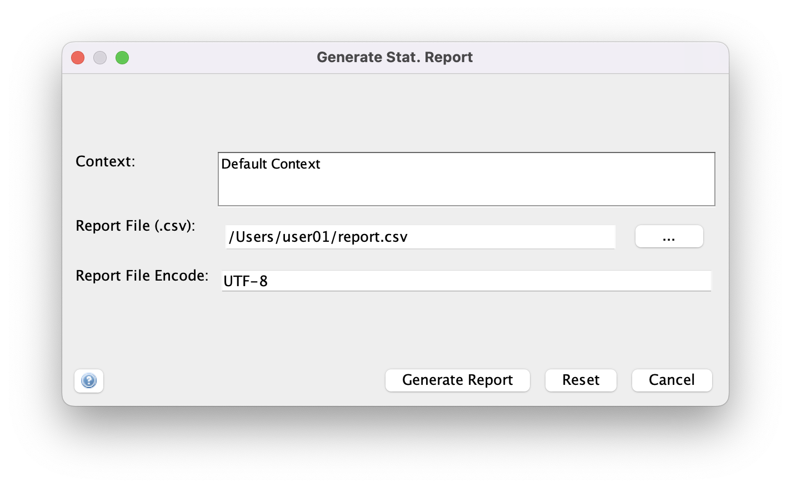
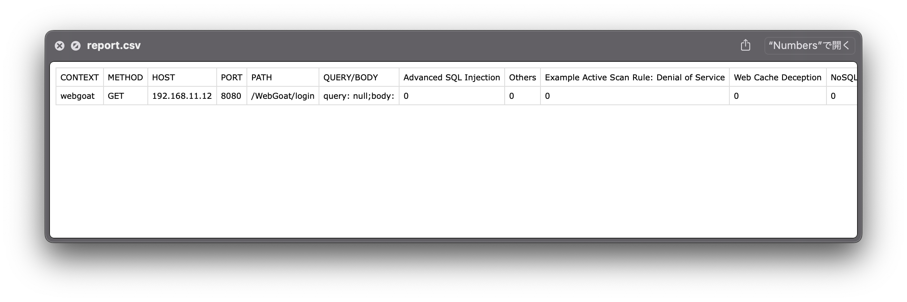

# StatReportExtention
An Owasp ZAP plugin to generate a CSV report summarizing scanned URLs vs the number of alerts

## Preparation
1. Install [Owasp Zap](https://www.zaproxy.org/) (>= 2.13)

## Installation
1. Download .zap file from the latest tag.
1. Launch Owasp Zap, click *File* > *Load Add-on File...*
1. Select the .zap file and click *Open*

## Usage

1. Before generating the report, execute an active scan for a context.
1. Click *Report* > *Generate Stat. Report*
1. In the dialog, 
   1. Select the scanned context(s)
   1. Input the report file path
   1. Input the encode (the preset value is the default encode)
   
1. Click *Generate*, then a csv file is saved at the selected location.
   
